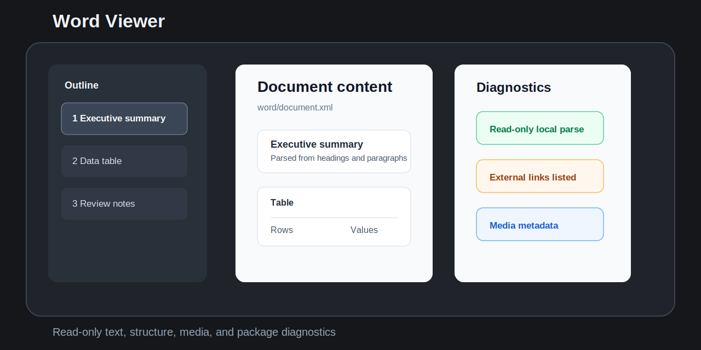
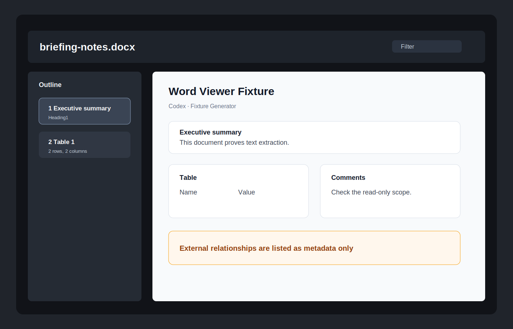

# Word Viewer



Word Viewer opens `.docx` files as a read-only inspection view inside the app. It focuses on document text, headings, tables, comments, footnotes, endnotes, media metadata, relationships, warnings, and package diagnostics.

## Features

- Opens `.docx` files from the file explorer with a dedicated read-only view.
- Parses the local OOXML zip package in the plugin with no cloud conversion.
- Shows document metadata, outline/headings, paragraphs, lists, tables, comments, footnotes, endnotes, media references, and package diagnostics.
- Filters document text, headings, comments, notes, hyperlinks, and media metadata.
- Warns about external relationships, embedded OLE/package content, macro-related package content, tracked changes, large documents, encrypted files, and malformed packages.
- Caps large render lists so big documents stay responsive.



## Non-goals

- No `.doc` legacy binary support in v0.1.
- No `.docm`, `.dotm`, or macro-enabled support in v0.1.
- No editing, saving, annotation, export, Markdown conversion, or write-back.
- No pixel-perfect Word rendering.
- No macro, VBA, OLE, ActiveX, or embedded object execution.
- No remote fonts, remote images, network calls, or cloud conversion.
- No launching Microsoft Word, LibreOffice, Pages, or another external viewer.
- No tracked-changes merge or review workflow.

## Install from release

1. Download `main.js`, `manifest.json`, and `styles.css` from the matching GitHub release.
2. Place them in `.obsidian/plugins/word-viewer/`.
3. Enable `Word Viewer` in Community plugins.

## Security and privacy

Word Viewer treats documents as untrusted local packages. It reads files through the vault API, renders local metadata and text, and does not send vault content to external services.

The plugin does not use network APIs, clipboard APIs, shell calls, external app launches, macro execution, embedded object execution, or file write-back APIs.

## Development

```bash
npm install
node scripts/create-fixtures.mjs
npm run build
npm run typecheck
npm test
npm run community:check
```

## Release

For each release:

1. Update `manifest.json`, `package.json`, and `versions.json`.
2. Run build, typecheck, tests, static checks, and SVG parse checks.
3. Create a GitHub release whose tag exactly matches `manifest.json.version`.
4. Attach `main.js`, `manifest.json`, and `styles.css` as release assets.

## Community review checklist

- Plugin id is `word-viewer`.
- `manifest.json` version matches `versions.json`.
- Release tag is exactly `0.1.1`, not `v0.1.1`.
- Release includes `main.js`, `manifest.json`, and `styles.css`.
- Runtime code does not use network, clipboard, shell, eval, write-back, or external app launch APIs.
- Manifest description avoids restricted product-name wording.
- Styles avoid `!important`.
- The viewer is read-only and handles unsupported documents gracefully.

## License

MIT
